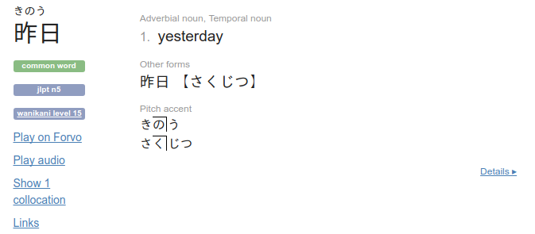
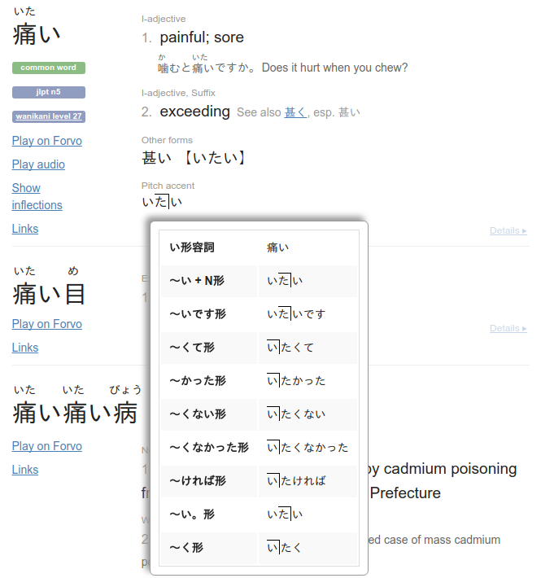

Jisho Pitch Accent
==================

This browser extension adds inline pitch accent notation for Jisho.

The data comes from a copy of the [WaDokuJT source data](https://github.com/WaDoku/WaDokuJT-Data).

Installation
------------

### Manual - Chrome

1. On this page, go to "Clone or download" -> "ZIP file" and unzip the downloaded file
2. Browse to chrome://extensions
3. Tick "Developer mode"
4. Click "Load unpacked extension"
5. Pick the unzipped directory
